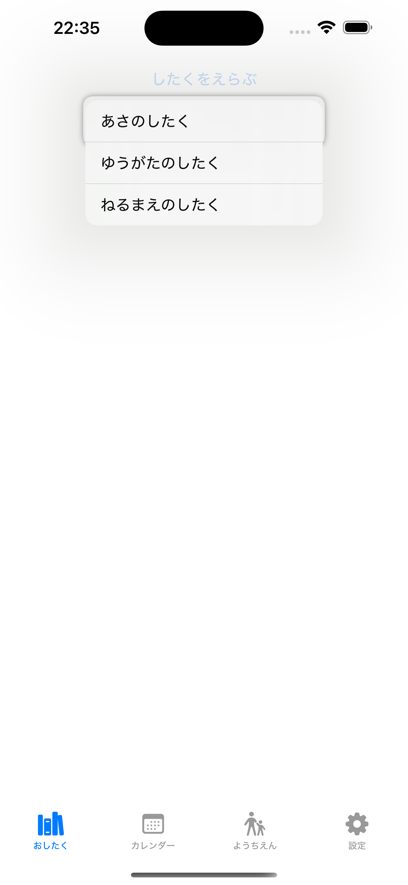
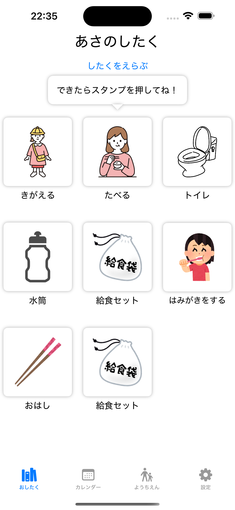
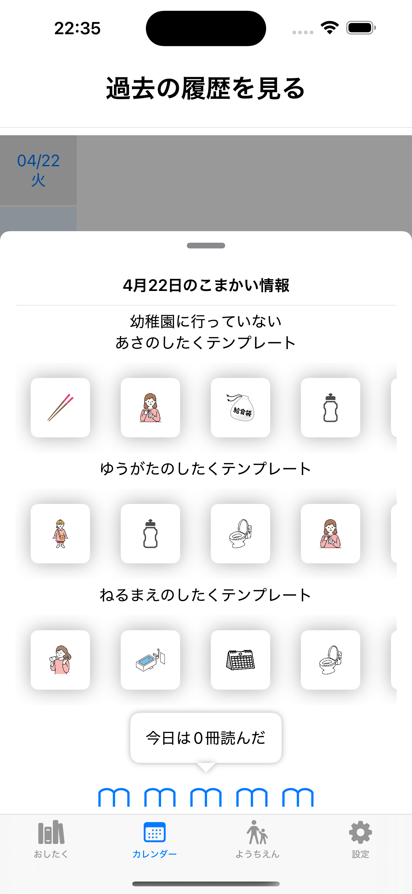
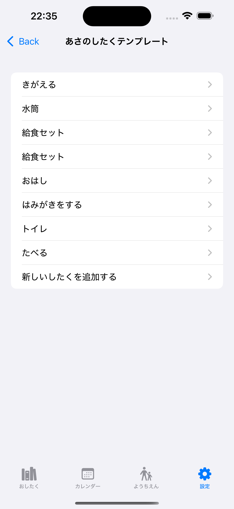

# 🎒 おしたくしよう - 子ども向けお支度支援アプリ

## 🧒 このアプリについて
**「おしたくしよう」**は、未就学児〜小学校低学年のお子さんが、毎朝の支度を自分でできるようになることを目指した、視覚的サポートアプリです。

保護者の「声かけ」に頼りすぎず、子どもの**自立心**と**達成感**を育む仕組みを、SwiftUIで実装しています。

---

## 🧠 背景と課題感

- 朝の支度がスムーズにいかない…
- つい「早くして！」と繰り返してしまう…
- 子ども自身のペースで取り組んでほしい…

こうした悩みを解決するために、「視覚的な進捗」が自然と分かるUIをデザインしました。

---

## 📸 画面紹介

| おしたく選択画面 | おしたく一覧 | 過去の履歴画面 | おしたく編集画面 |
|------------|------------|-------------------------|-------------------------|
|  |  |  |  |

---

## 🔧 技術スタック

- SwiftUI（100%）
- DB:SwiftDataによるローカルDB
- MVVM設計
- App Groupを活用したWidget連携
- アクセシビリティ意識したデザイン

---

## 💡 このアプリで挑戦したこと

- 子どもの視点に立ったUX設計（色、サイズ、配置、操作数）
- カスタムタスクの追加機能
- 親が操作せずに済む「完全子ども完結型UI」
- SwiftUIのみでの画面遷移・状態管理（AppStorage) 

---

## 🚀 今後の展望

- iCloud同期対応
- タイマー機能追加
- Firebase連携によるログ保存
- 発達支援・療育との連携UI

---

## 📮 お問い合わせ

気になる点があれば、Issueまたは [Email](campsisgrandiflora0722@gmail.com) へどうぞ！
